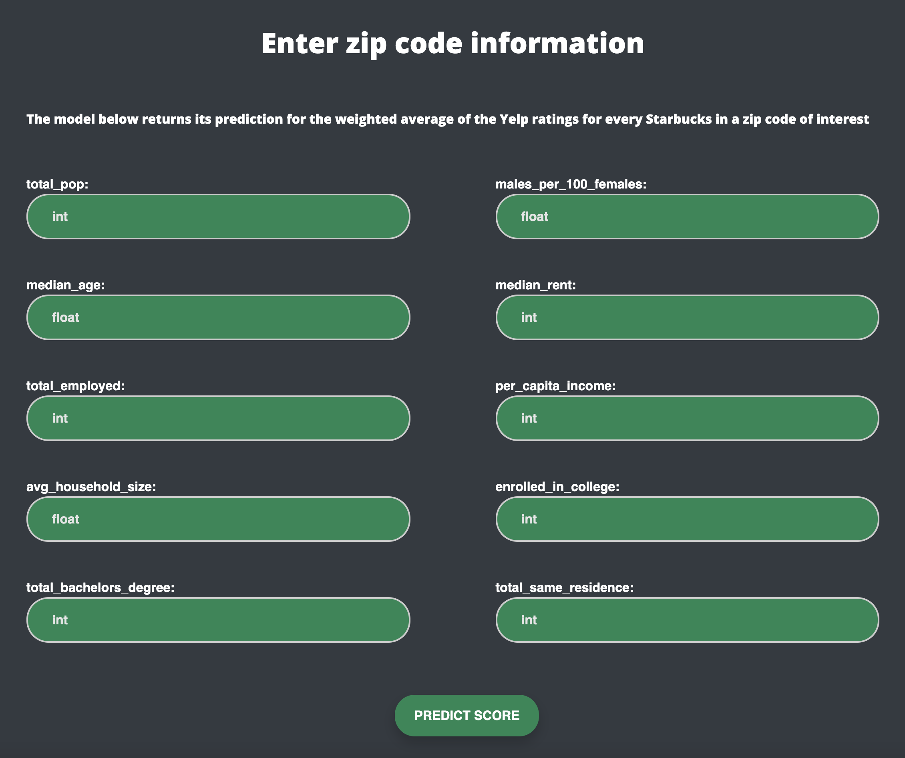
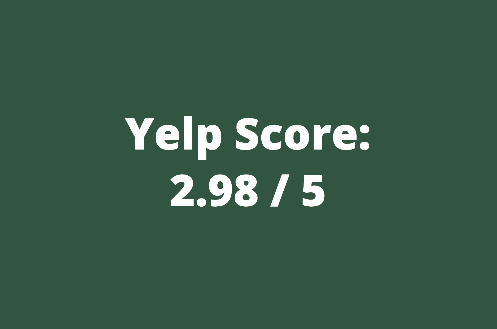
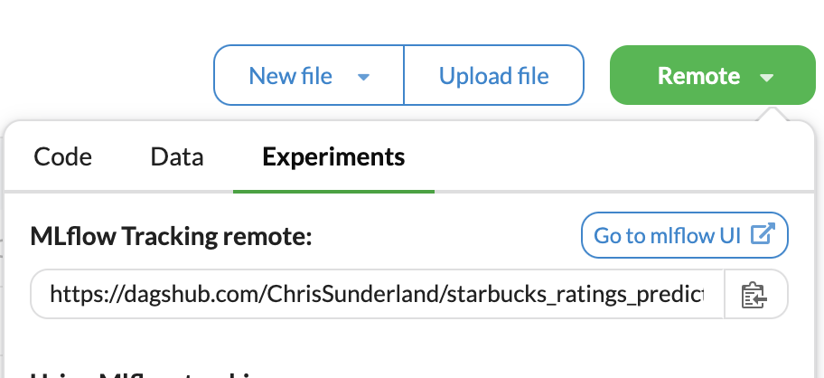

# STARBUCKS RATINGS PREDICTIONS

## Background

In this end-to-end machine learning project I used demographic data to train a model that aimed to predict the 
likelihood of a business succeeding in a particular location/community. More specifically, the model I developed used 
US census data to predict the level of "success" that the Starbucks coffee chain has had in a zip code of interest. 
Additionally, I created a web application that utilizes this model to generate new predictions.

Since I obviously don't have access to sales data for individual Starbucks stores, I relied on Yelp review data
to create my own metric that attempted to quantify a store's "success". The metric/outcome I ultimately computed was 
a kind of weighted average of the Yelp ratings for every Starbucks location in a zip code. In this formula I 
scaled each store's average rating by the total number of reviews it had received. Below I've walked through an example 
of how I would calculate this score for a zip code in the dataset...

* Total Starbucks locations: **2**
  * Store 1 rating: **3.3** (average computed from **42 reviews**)
  * Store 2 rating: **2.5** (average computed from **27 reviews**)
* Overall Score: 
  * 3.3(42)+ 2.5(27) / 42+27 = **2.99**
  
As far as data sources, I relied on the Yelp Fusion API to collect Starbucks review data for the various zip codes. 
For the demographic data I utilized several datasets from the US Census Bureau's American Community Survey. The fields I used to train the model can be 
seen in both the web app I developed and the "schema.yaml" file inside this repository. I also want to point out 
that I focused specifically on zip codes and Starbucks locations inside the state of Colorado for this project.

Lastly, one can find instructions further below for how to run the project locally, use MLflow to evaluate the model's 
performance, and deploy the model via an AWS EC2 instance. 

## API Documentation

[Yelp Fusion API](https://docs.developer.yelp.com/docs/fusion-intro)

After signing up for a free 30 day trial of the Yelp Fusion API, you'll be able to obtain an API key. Should you do so,
please note that you'll then need to add 'yelp_api_key' to your local .env file and assign your API key to that variable.

##  How to run project locally

While a Yelp API key is technically needed to run the data ingestion portion of this project, I've provided the 
raw datasets to make it possible to run the program without an API key. Simply follow the steps below.

**1)** Clone this repository

```bash
git clone https://github.com/ChrisSunderland/starbucks_ratings_predictions.git
```

**2)** Navigate to the repository from your terminal

**3)** Create a new virtual environment using 1 of the 2 commands

```bash
conda create -n your_env_name python=3.10 -y
```

```bash
python3.10 -m venv your_env_name

```

**4)**  Activate virtual environment and install the required packages

```bash
pip install -r requirements.txt
```
**5)**  Run the following command
```bash
python app.py
```
**6)**  Click on the provided link to navigate to the web app 

**7)**  To train the model, add "/train" to the website URL

**8)**  Return to the app's home page and fill in the fields to generate a prediction




# How to evaluate model performance with MLflow

**1)** First push your local repository to GitHub

**2)** If needed, create a [Dagshub](https://dagshub.com/) account

**3)** Log in to Dagshub and connect your Github repository

**4)** Update your local .env file with the following variables 

```bash
MLFLOW_TRACKING_URI=your_uri
MLFLOW_TRACKING_USERNAME=your_username
MLFLOW_TRACKING_PASSWORD=your_password
```

**5)** Adjust the hyperparameters in the "params.yaml" file (optional)

**6)** Run the following command

```bash
python main.py
```

**7)** Inside your Dagshub repository, navigate to the mlflow UI



<br>
<br>
Once there, you'll be able to view how models with different hyperparameters performed on the test set.

# How to deploy model with Github Actions and AWS

**1)** After creating an account, log in to the [AWS](https://aws.amazon.com/console/) console

**2)** Create IAM user with the attached policies

    AmazonEC2ContainerRegistryFullAccess

    AmazonEC2FullAccess

**3)** Create ECR repository and save the repository's URI

**4)** Create EC2 instance (Ubuntu)

**5)**  Open EC2 instance and run the following commands to install docker

	sudo apt-get update -y

	sudo apt-get upgrade

	curl -fsSL https://get.docker.com -o get-docker.sh

	sudo sh get-docker.sh

	sudo usermod -aG docker ubuntu

	newgrp docker

**6)** Navigate to your GitHub repository's settings to create a new self-hosted runner
    
    settings > actions > runner > new self hosted runner > choose os 

**7)** Copy the commands from GitHub and run each of them in your EC2 instance

**8)** Navigate to the secrets section of  your GitHub repository's settings

    settings > secrets and variables > actions

**9)** Fill in the fields below with their associated values and add each one of them as a secret

    AWS_ACCESS_KEY_ID=

    AWS_SECRET_ACCESS_KEY=

    AWS_REGION=

    AWS_ECR_LOGIN_URI= 

    ECR_REPOSITORY_NAME= 

**10)** Commit and push any changes to GitHub

**11)** Return to your EC2 instance and edit inbound rules

    security > security groups > edit inbound rules

**12)** Add the following rule

    Type: Custom TCP, Port Range: 8080, Source: Custom 0.0.0.0/0

**13)** To view the app, navigate to your instance's Public IPv4 Address and provide the port number

## Acknowledgments

While this project largely features my own original work, I want to note that I did follow a template and workflow similar to the one
in this [video](https://www.youtube.com/watch?v=pxk1Fr33-L4) from Krish Naik's YouTube channel. One can also refer to 
this video for more detailed instructions on how to use MLflow as well as AWS to deploy a model.